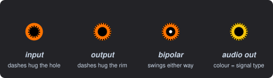
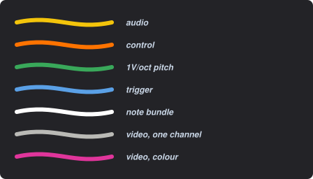
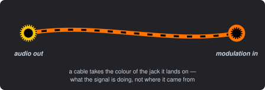
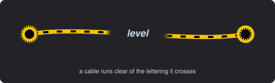

# DreamRack

DreamRack is a modular synthesizer that runs in a web browser, built on Web Audio. You place modules on a rack, wire their jacks with virtual cables, turn the knobs, and listen — the feel of a hardware modular, with a few things a screen can do that hardware can't.

More than that, it's an exploration. It began as an attempt to build the modular I've always wished I could patch on, and to try out ideas for making one easier to use and more powerful. It's a personal project: free software, source on GitHub under the GNU Affero General Public License v3, and shared in the hope that others enjoy it as much as I do. Your mileage may vary. 😌

<!-- A picture of the rack belongs here — one wide screenshot with a patch on it, light mode. -->

## A few things you won't find elsewhere

**A tab can be a voice.** The rack splits into tabs, and a tab is not just somewhere to put modules — it can be an instrument. Drop a **Voice In** module on a tab and that tab becomes a voice; set its POLYPHONY knob to eight and the whole tab runs eight times over, one copy per sounding note, wired exactly as you wired it once. Every module on the tab says whether it is *per note* or *shared*, so an oscillator becomes eight oscillators while the reverb next to it stays one. A single polyphonic composite cable carries up to eight notes at once between tabs, each with its own pitch, velocity, length, position and movement while it sounds — so the tab that plays the notes and the tab that makes the sound stay separate things.

**Live coding, patched into the rack.** DreamRack imports Strudel — the whole language, as a JavaScript package — and gives it a module. A pattern's parts leave by eight note outputs, `.rack(1)` to `.rack(8)`, each carrying a whole polyphonic voice down one cable to a voice tab; a part that names a sound instead plays Strudel's own voices, which come out of the module as ordinary audio to be mixed with everything else. The editor is Strudel's own, in a window you open from the faceplate, with the playing notes lit as they sound.

**Video and audio in the same rack.** Video is a full second signal family here, with its own modules, its own cable colours and its own rules about what may plug into what: control voltage may drive a video parameter, an image may not be summed into an audio input. Build a shape, move it with the same envelopes and clocks driving your sound, and watch it on a Video Output module in the rack.

**Instruments, not guesswork.** Listen at any terminal without unplugging anything. Clip a scope onto any jack — as many as you like at once — and drag it beside the knob that's shaping it to watch the trace as you turn. Read the frequency, the maximum and minimum, and the DC offset at any point. Ask what feeds a module, what it feeds, and what shapes any one signal, and see just that chain lit up. And know what the rack is costing: a Load module reads the audio thread as a percentage of one core — the ceiling that matters, since that thread cannot spread across the others — with the worst block in the last window and a lamp for anything actually dropped.

**The knAck.** A control you turn *and* plug a cable straight into, so a parameter and its CV input share one spot instead of costing a knob and a jack. Each can carry an attenuverter — switched on per knob — to set how far, and in which direction, the plugged signal moves it.

**Modules are plug-ins, and you can draw one.** Every module is a self-contained folder of plain JavaScript that drops in without touching the core and without a build step. The faceplate comes with it: describe the panel in a small layout grammar, or draw it in the built-in panel editor and let it write the file. See the [module-authoring reference](MODULE-AUTHORING.md).

**A rack an AI can read.** DreamRack writes its whole live state — every module, every cable, every knob — to a folder as plain JSON, and reads a patch back from the same place. An assistant can look at what you have built, describe it, and hand you a change to approve.

## What's in it today

Twenty-nine modules ship:

- **Sources** — Complex Oscillator, VCO, Macro Oscillator 2, Sine Source, Noise
- **Shaping** — Quad Low Pass Gate, Filter, VCA, Quad Function Generator, ADSR, Delay, Octave
- **Timing and sequencing** — drClckd, Sequencer / Programmer Eight, Random Sampler, Strudel
- **Voices** — Sequence Out, Voice In, Poly to Stereo
- **Video** — Coordinate Field, Shapes, Formula, Video Maths, Compositor, Time, Video Output
- **Utility** — Control Gallery, Load, Mixer / Output

Modules of any kind drop in as plug-ins, with or without a hardware ancestor. Many more are planned, and suggestions are welcome.

## The visual language

I think this is the cleanest visual language of any modular of this kind, and it is worth a minute of your time because everything below is true of **every** module, including ones you write yourself.

**A jack tells you what it is without a word of panel art.** Its colour is the signal family. Its dashed ring says which way the signal runs — an output's dashes hug the outer rim, an input's hug the hole — so you never hunt for an arrow or a heading. A white dot in the middle marks a jack that deals in a signal swinging either side of zero, and the absence of one is a promise: no dot means unipolar, by design.

**A cable's colour is the job it does where it lands**, so the same signal can be audio at one end of the rack and modulation at the other and each end reads correctly. Video is a family of its own, and the note bundle — the one cable carrying events rather than a continuous signal — is the one with no hue at all, which is what tells it apart at any zoom and for any kind of colour vision.

An oscillator's output driving another module's modulation input makes the rule plain: the signal is audio, the job it does where it lands is modulation, and the cable is the colour of the job. So you can read a patch by following colour without knowing what any module does.

**Cables never hide the panel.** Crawling dashes along each one show which way the signal runs, and every cable turns transparent exactly where it crosses lettering — so a dense patch still reads, and you can follow one cable across the rack without anything being dimmed to let you.

**Every panel is drawn from code, not painted.** A faceplate is a short description — this knob here, that jack there, these lamps — and the light and dark versions are generated from it. That is what keeps the language consistent: nobody is redrawing a jack by eye, a proportion changed centrally changes everywhere, and a check refuses any panel whose art has drifted from its description or spilled off its own face. It is also why a module you write looks like one that shipped.

## How it feels to use

Controls turn with the scroll wheel and patching is click to grab, click to drop, with nothing held down — a click is easier on the wrist than a drag, and once you've patched this way for an hour the hardware gesture starts to feel like work.

Everything works the same in light and dark, and the rack remembers where you left it — the tab you were on, the view, and the patch — so reopening it puts you back where you were.

## Where it's going

- **A consistent design language across every module**, so knowledge carries from one to the next. *(done)*
- **Polyphony** — more than one voice at a time. *(done — see the tab-is-a-voice note above)*
- **Video synthesis sharing the rack with audio.** *(done)*
- **Hear the signal at any terminal**, effortlessly, without rewiring. *(done)*
- **See the signal at any terminal** — scopes you clip on and take off, as many as you want at once. *(partly TBD — dual trace still to come)*
- **Know the numbers at any terminal** — frequency, maximum and minimum, DC offset. *(done)*
- **See what affects what** — what feeds a module, what it feeds, and the whole chain shaping any one point. *(done)*
- **Let any developer create new modules, and anyone snap them into their rack.** *(done)*
- **Live coding inside the rack** — a pattern language driving the voices, and its own voices mixed beside them. *(done — see the Strudel note above)*
- **Explore how AI might help understand and create patches** — describing what a patch does, suggesting changes, or building one from a request. *(done — the rack is readable and writable, and an assistant can hand a patch back for you to approve)*
- **Inject a signal into any jack** without disturbing the patch cables — a button to fire a trigger, a toggle to hold a gate, or a simple sine or square wave. *(TBD)*
- **Take input from outside** — an interface module that receives events from other sequencers and hosts and converts them into DreamRack notes to play. *(partly done — Strudel plays the rack from inside it; a socket for outside senders is still to come)*

## Current state

DreamRack is in alpha — fully usable, but expect rough edges and things to change. Even the parts marked done may still change as I work on perfecting the design and receive feedback from users.

Share thoughts, bugs, and ideas in the [discussions](https://github.com/chrisgr99/DreamRack/discussions).

## Running it

There's nothing to download or install. Open it at [dreamrack.dreamerdevelopment.app](https://dreamrack.dreamerdevelopment.app/) and follow the getting-started notes that appear on first run.

A desktop version, built on Electron, is fully running now. A packaged, one-click download will follow once the app settles a little — code-signing and notarizing it (so that macOS opens it without a security warning) is worth doing when the build is less subject to change. Until then you can run the desktop app yourself: with [Node.js](https://nodejs.org/) installed, clone the project from GitHub, open its folder in Terminal, and run `npm start`. A Windows or Linux desktop build is possible too — Electron is cross-platform — but for now the easiest way to run DreamRack on those systems is in the browser.

It works in most browsers — Chrome, Edge, Firefox, or Safari. Saving and loading patches as files relies on the browser's File System Access feature, which today is only in Chrome and Edge, so use one of those if you want to keep your patches; everything else works the same everywhere.

**One caveat — turn off page-recolouring extensions.** If you use an add-on that changes how pages look (Dark Reader, or any dark-mode or colour-adjusting extension), disable it for DreamRack. The app has its own light and dark modes, and these extensions distort the panels and lettering — the most likely culprit if anything ever looks wrong.

## License

DreamRack is free software under the **GNU Affero General Public License, version 3** — see
[LICENSE](LICENSE).

Affero rather than plain GPL because DreamRack embeds [Strudel](https://strudel.cc), which is
AGPL-3.0-or-later. The practical difference is section 13: anyone who runs a modified DreamRack as a
hosted service has to make their source available to the people using it. That costs this project
nothing — DreamRack is client-side and its source is published, so every user already receives it.

Version 3 only, not "or later". Some of the DSP here is derived from VCV Rack plugins, and
[FrozenWasteland](https://github.com/almostEric/FrozenWasteland) is GPL-3.0-only, so version 3 is
what the combination can carry. [Fundamental](https://github.com/VCVRack/Fundamental) is
GPL-3.0-or-later, satisfied by using it under version 3. GPLv3 section 13 is what allows GPL-3.0-only
code and AGPL-3.0 code to be combined at all: those parts stay under their own licence, and the
network clause applies to the combination.

A module whose DSP is derived from either names its source in that module's folder.
